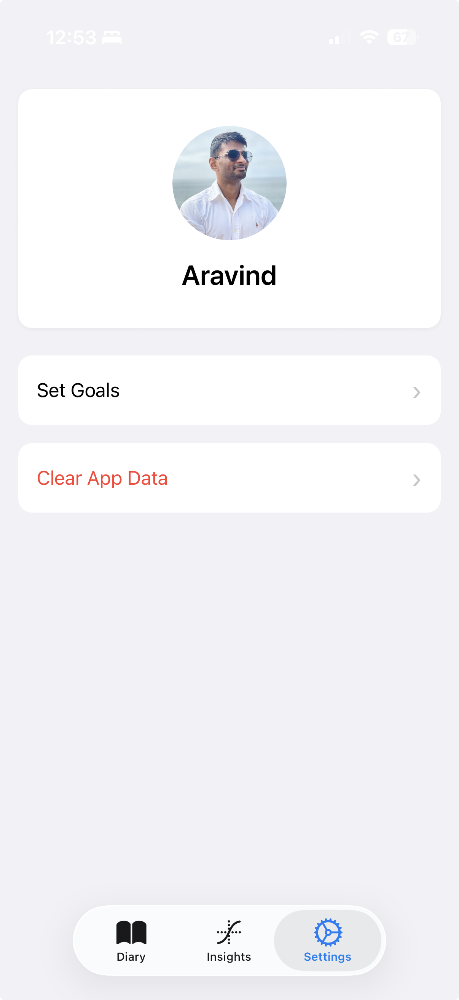

# Overview

A light-weight open-sourced calorie tracker.

1. Most trackers in the app store are bloated -- Include social features, recipes, cloud backup, etc.
2. Heavily paywalled or too many ads.
3. You don't own your data anymore, it's stored in the app's cloud where they get to decide what they want to do with it.

Noms is a simple food journal with daily aggregates and long-term visual insights using graphs that helps you track your food consumption. Everything is stored locally.

# Screenshots

| Diary | Insights | Settings |
|:---:|:---:|:---:|
|  |  |  |

# Build

The app is only tested on iOS devices, android UX might be broken. The app uses expo, follow expo build instructions.

```
$ npm run ios # Start dev run on iOS.
```

# TODOs
- [x] Implement a catalog of food entries to quick add.
- [ ] Fix Set Goals UI to match add.tsx screen. The UX looks off.
- [ ] Add goal direction, eating surplus calories is not always a negative.
- [ ] Add barcode scanning option: items in catalog can be linked to a barcode value and used to quick add entries.
- [ ] Implement option to import/export data.
- [ ] Only load last X days of data into memory and load remaining on-demand.
- [ ] Pre-aggregate old data and store it in a table to avoid re-computation.
- [ ] Allow selecting graphs in insights. Make it a customizable dashboard.
- [ ] Read Apple Health data for calories burned, weight, etc to add new graph types for insights.