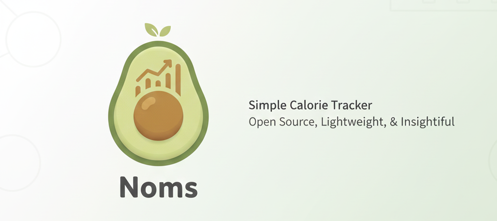
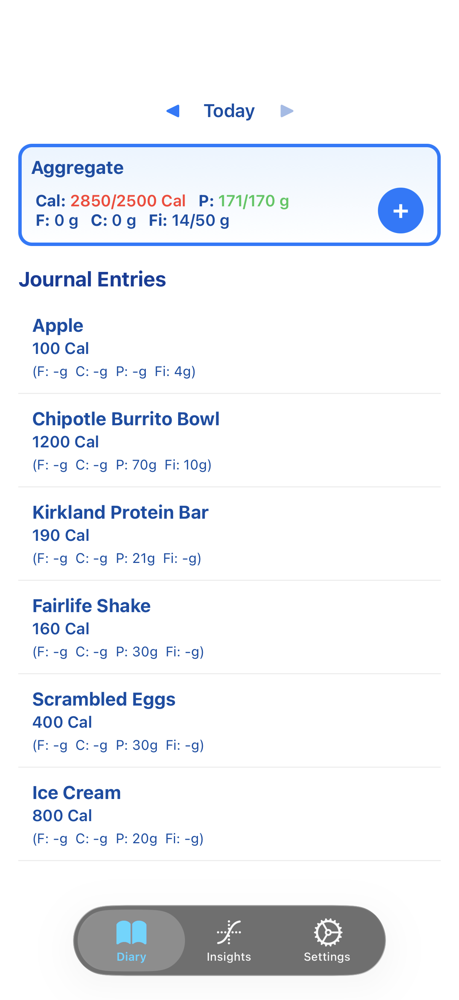
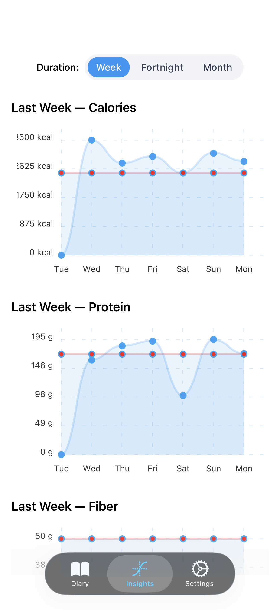

# Overview

A light-weight open-sourced calorie tracker.

1. Most trackers in the app store are bloated -- Include social features, recipes, cloud backup, etc.
2. Heavily paywalled or too many ads.
3. You don't own your data anymore, it's stored in the app's cloud where they get to decide what they want to do with it.

Noms is a simple food journal with daily aggregates and long-term visual insights using graphs that helps you track your food consumption. Everything is stored locally. 

# Screenshots

| Diary | Insights |
|:---:|:---:|
|  |  |
